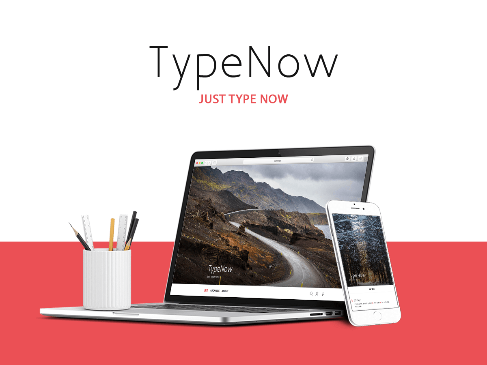

# TypeNow

### 主题说明

TypeNow 根据 WordPress 官方主题 [TwentySeventeen](https://github.com/WordPress/WordPress/tree/master/wp-content/themes/twentyseventeen) 框架结构修改。

### 主题安装

Clone 或者 [下载 Zip](https://github.com/85Ryan/TypeNow/releases/latest) 文件 ，上传到 `wp-content/themes` 文件夹。

仅在以下环境测试可行，其他环境下请自行测试：

- WordPress 4.7 及以上版本
- PHP 7.1
- Chrome 62.0 or Safari 11.0

### 主题预览

[iiiryan.com](https://iiiryan.com)

### 主题亮点

- 更丰富的主题自定义设置选项
- HighlightJS 代码高亮
- 文章目录
- 相关文章
- 评论验证码
- 自定义文章样式：aside、status、quotes
- 自定义页面模板：archive、search
- 更多精彩期待着你的发现……

### 第三方资源

HTML5 Shiv, Copyright 2014 Alexander Farkas  
Licenses: MIT/GPL2  
Source: [https://github.com/aFarkas/html5shiv](https://github.com/aFarkas/html5shiv)  

jQuery scrollTo, Copyright 2007-2015 Ariel Flesler  
License: MIT  
Source: [https://github.com/flesler/jquery.scrollTo](https://github.com/flesler/jquery.scrollTo)  

normalize.css, Copyright 2012-2016 Nicolas Gallagher and Jonathan Neal  
License: MIT  
Source: [https://necolas.github.io/normalize.css](https://necolas.github.io/normalize.css)  

Site title font: Aaargh  
License: Creative Commons attribution license  
Source: [https://www.fontsquirrel.com/fonts/aaargh](https://www.fontsquirrel.com/fonts/aaargh)  

Font Awesome icons, Copyright Dave Gandy  
License: SIL Open Font License, version 1.1  
Source: [http://fontawesome.io/](http://fontawesome.io/)  

Bundled header image：

- Header Image 1: [Photo by Mathieu Barrette on Unsplash](https://unsplash.com/photos/RYd9aBMp194)
- Header Image 3: [Photo by Simon Matzinger on Unsplash](https://unsplash.com/photos/-O8r5oLosYo)
- Header Image 2: [Photo by dan carlson on Unsplash](https://unsplash.com/photos/EXSh-k3wjds)
- Archive Page Header Image: [Photo by Rob Bates on Unsplash](https://unsplash.com/photos/AyYW_bUWerc)
- About Page Header Image: [Photo by Max Langelott on Unsplash](https://unsplash.com/photos/Hw62tzAkXXE)
- Search Page Header Image: [Photo by Hedi Alija on Unsplash](https://unsplash.com/photos/V21dkuL8dnM)
- Aside Post Featured Image: [Photo by Anete Lūsiņa on Unsplash](https://unsplash.com/photos/VwiLLyETLcQ)
- Related Post Default Image: [Photo by Breather on Unsplash](https://unsplash.com/photos/pDifHWbftrg)

部分 CSS 样式参考：Pinghsu, A Typecho Theme  
License: MIT  
Source: [https://github.com/chakhsu/pinghsu](https://github.com/chakhsu/pinghsu)  

WordPress breadcrumbs function  
License: MIT  
Source: [http://dimox.net/wordpress-breadcrumbs-without-a-plugin/](http://dimox.net/wordpress-breadcrumbs-without-a-plugin/)  

Get copyright time  
Source: [https://www.gznotes.com/wp-copyrighttime/](https://www.gznotes.com/wp-copyrighttime/)  

Display Metaboxes According to the Current Post Format  
Source: [https://code.tutsplus.com/tutorials/how-to-display-metaboxes-according-to-the-current-post-format--wp-27970](https://code.tutsplus.com/tutorials/how-to-display-metaboxes-according-to-the-current-post-format--wp-27970)  

### 就这样吧....